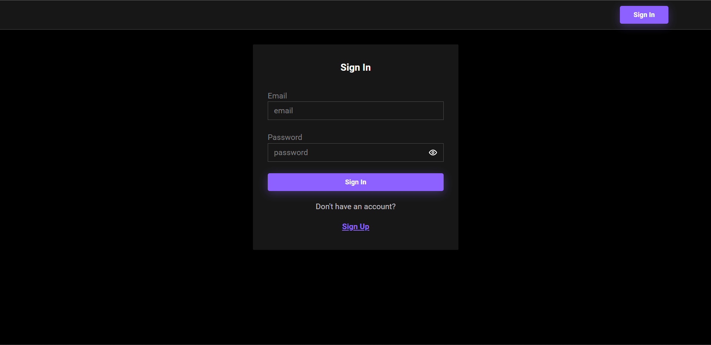
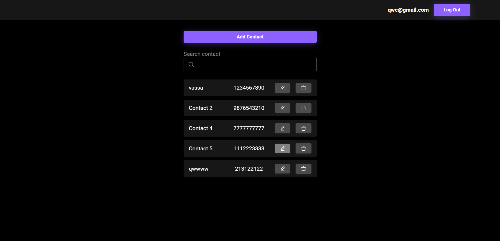
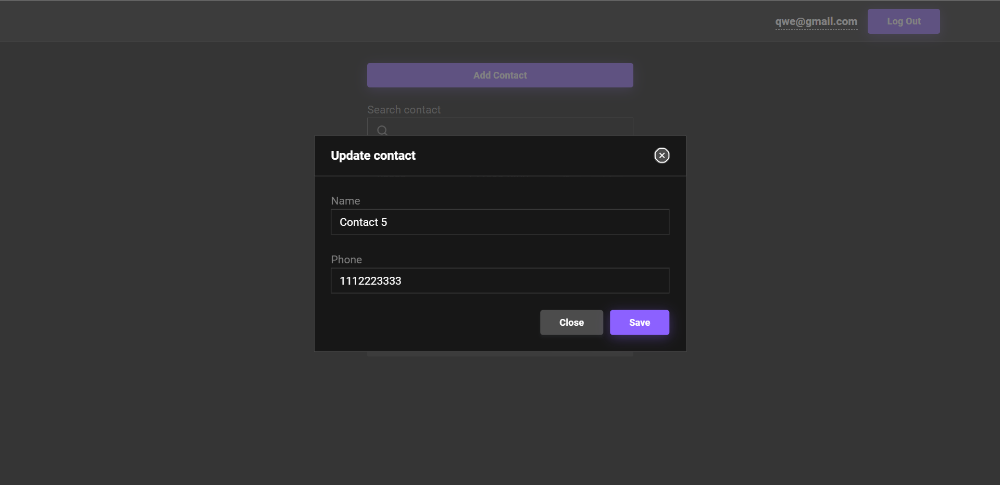

#  Тестовое задание Front-end Developer

## Описание

Этот проект представляет собой реализацию личного кабинета с тремя страницами:  страницей регистрации, входа и страницей со списком контактов.

---

### Можно воспользоваться уже созданными аккаунтами или же сделать новый

1. - email: user2@gmail.com
   - password: 123qwe

2. - email: qwe@gmail.com
   - password: qweqwe

---

### Технологии:

- TypeScript
- React
- Redux-toolkit
- React-Router-Dom
- Redux-Thunk
- Axios
- React-Hook-Form
- Json-Server
- Json-Server-Auth
- Radix-UI

---

## Запуск приложения

### Установите зависимости:

### `pnpm install`

### Запустите приложение вместе с сервером JSON Server с моковыми данными для авторизации и контактов:

### `pnpm run start`

Приложение будет доступно по адресу http://localhost:3000.

### Версия Node.js

### `node -v : 18.17.0`

---

## Если у вас есть какие-либо вопросы или замечания по проекту, пожалуйста, свяжитесь со мной:

- Email: vlad.loban.dev@gmail.com     
- Telegram: https://t.me/wad_loban

